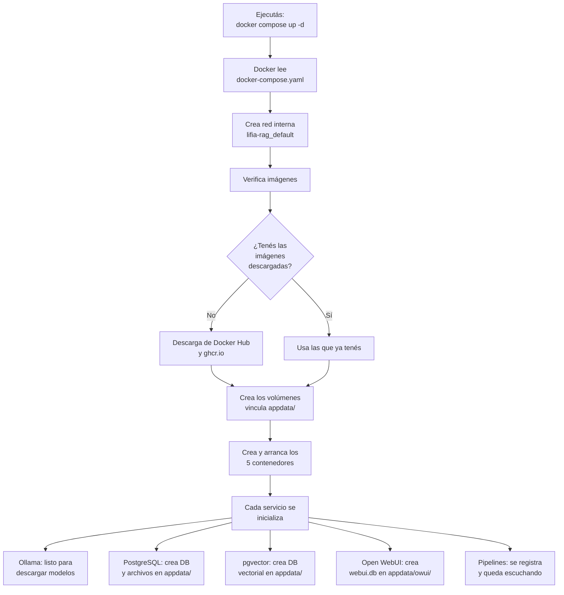
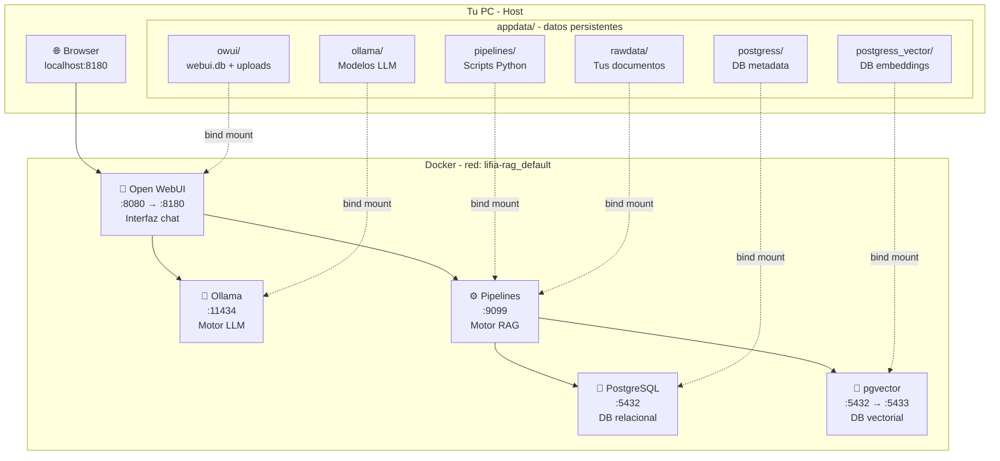
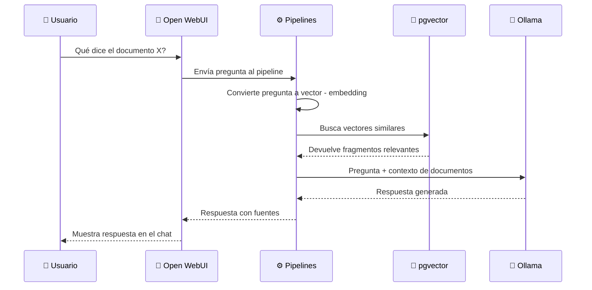

# 🐳 Guía completa: `docker-compose.yaml` del proyecto Lifia-Rag

## Tabla de contenidos

1. [¿Qué es Docker y Docker Compose?](#1-qué-es-docker-y-docker-compose)
2. [Estructura general del archivo](#2-estructura-general-del-archivo)
3. [Análisis detallado de cada servicio](#3-análisis-detallado-de-cada-servicio)
4. [Los archivos `.env` — Variables de entorno](#4-los-archivos-env--variables-de-entorno)
5. [La sección `volumes` — Cómo se genera `appdata/`](#5-la-sección-volumes--cómo-se-genera-appdata)
6. [¿Qué pasa exactamente cuando ejecutás `docker compose up`?](#6-qué-pasa-exactamente-cuando-ejecutás-docker-compose-up)
7. [¿Qué se guarda en cada carpeta de `appdata/`?](#7-qué-se-guarda-en-cada-carpeta-de-appdata)
8. [Diagrama de arquitectura completo](#8-diagrama-de-arquitectura-completo)
9. [Guía de modificaciones comunes](#9-guía-de-modificaciones-comunes)
10. [Comandos útiles de Docker Compose](#10-comandos-útiles-de-docker-compose)
11. [Troubleshooting — Problemas comunes](#11-troubleshooting--problemas-comunes)

---

## 1. ¿Qué es Docker y Docker Compose?

### Docker en 30 segundos

Docker es una herramienta que permite **empaquetar una aplicación con todo lo que necesita** (sistema operativo, librerías, configuración) en un "contenedor". Pensalo como una caja que contiene todo para que la app funcione, sin importar en qué máquina la corras.

| Concepto | Analogía |
|---|---|
| **Imagen** | Una receta de cocina — las instrucciones para crear algo |
| **Contenedor** | El plato cocinado — una instancia viva de la imagen corriendo |
| **Volumen** | El freezer — donde guardás datos para que sobrevivan si tirás el plato |
| **Puerto** | La ventanilla — por dónde te comunicás con lo que está adentro |

### Docker Compose en 30 segundos

Cuando tu proyecto necesita **múltiples contenedores** que trabajan juntos (como este, que tiene 5), manejarlos uno por uno sería un infierno. Docker Compose te deja definir **todos los servicios en un solo archivo YAML** (`docker-compose.yaml`) y levantarlos/bajarlos con un solo comando.

```
Sin Compose: tendrías que ejecutar 5 comandos "docker run" con 50 flags cada uno.
Con Compose:  ejecutás "docker compose up" y listo.
```

---

## 2. Estructura general del archivo

El archivo `docker-compose.yaml` tiene **dos secciones principales**:

```yaml
services:        # ← Los contenedores que quiero levantar
    ollama:      #   Servicio 1
    db:          #   Servicio 2
    vdb:         #   Servicio 3
    open-webui:  #   Servicio 4
    pipelines:   #   Servicio 5

volumes:         # ← Dónde guardo los datos persistentes
    ollama_data:
    owui_data:
    pg_data:
    pgv_data:
    pipelines:
    rawdata:
```

> [!NOTE]
> YAML es un formato de texto donde **la indentación importa**. Cada nivel de indentación (2 o 4 espacios) indica que algo está "adentro" de lo anterior. **Nunca uses tabs**, solo espacios.

---

## 3. Análisis detallado de cada servicio

### 3.1 — `ollama` (El motor de IA / LLM)

```yaml
ollama:
    image: ollama/ollama              # 1
    restart: unless-stopped           # 2
    env_file:                         # 3
       - env/ollama.env
    ports:                            # 4
       - "${OLLAMA_PORT:-11434}:11434"
    volumes:                          # 5
        - ollama_data:/root/.ollama
```

| # | Línea | Qué hace |
|---|---|---|
| 1 | `image: ollama/ollama` | Descarga la imagen oficial de Ollama desde Docker Hub. Es el motor que corre modelos LLM (como Llama 3, Mistral, etc.) **localmente en tu máquina**. |
| 2 | `restart: unless-stopped` | Si el contenedor crashea, Docker lo reinicia automáticamente. Solo se detiene si vos lo parás manualmente con `docker compose stop`. |
| 3 | `env_file: - env/ollama.env` | Carga variables de entorno desde el archivo `env/ollama.env`. En este caso contiene `OLLAMA_ORIGINS=*` que permite que cualquier origen (otro contenedor) se conecte. |
| 4 | `ports: "${OLLAMA_PORT:-11434}:11434"` | Mapea el puerto. **Formato: `PUERTO_HOST:PUERTO_CONTENEDOR`**. Si existe la variable `OLLAMA_PORT` en tu sistema, usa ese valor; si no, usa `11434` por defecto. Esto hace que `localhost:11434` en tu PC llegue al puerto `11434` dentro del contenedor. |
| 5 | `volumes: ollama_data:/root/.ollama` | Conecta el volumen `ollama_data` (definido abajo) con la carpeta `/root/.ollama` **dentro del contenedor**. Ahí es donde Ollama guarda los modelos descargados. |

#### La sección de GPU (comentada)

```yaml
#        deploy:
#            resources:
#                reservations:
#                    devices:
#                        - driver: nvidia
#                          count: 1
#                          capabilities: [gpu]
```

Esto está **comentado** (con `#`). Si lo descomentás, Docker le asignaría una **GPU NVIDIA** al contenedor para acelerar la inferencia del modelo. Requiere:
- Una GPU NVIDIA física en la máquina
- Drivers NVIDIA instalados
- El [NVIDIA Container Toolkit](https://docs.nvidia.com/datacenter/cloud-native/container-toolkit/) instalado

> [!IMPORTANT]
> Sin GPU, Ollama corre en **CPU**. Funciona, pero es mucho más lento. Modelos grandes (>7B parámetros) pueden tardar mucho en responder.

---

### 3.2 — `db` (PostgreSQL — Base de datos relacional)

```yaml
db:
    image: postgres:15-alpine         # 1
    restart: unless-stopped           # 2
    env_file:                         # 3
        - env/db.env
    ports:                            # 4
        - "${DB_PORT:-5432}:5432"
    volumes:                          # 5
        - pg_data:/var/lib/postgresql/data
```

| # | Línea | Qué hace |
|---|---|---|
| 1 | `image: postgres:15-alpine` | PostgreSQL versión 15, variante `alpine` (imagen liviana basada en Alpine Linux, ~80MB vs ~400MB de la versión normal). |
| 2 | `restart: unless-stopped` | Reinicio automático ante crashes. |
| 3 | `env_file: - env/db.env` | Carga el password: `POSTGRES_PASSWORD=pass123`. PostgreSQL crea automáticamente un usuario `postgres` con esta contraseña al iniciar por primera vez. |
| 4 | `ports: "${DB_PORT:-5432}:5432"` | Puerto por defecto de PostgreSQL. Accesible desde tu PC en `localhost:5432`. |
| 5 | `volumes: pg_data:/var/lib/postgresql/data` | Los datos de la DB se guardan en `appdata/postgress/` de tu proyecto. |

> [!TIP]
> Este PostgreSQL es usado para almacenar **metadata** del sistema (configuración, usuarios, estado de los pipelines, etc.).

---

### 3.3 — `vdb` (pgvector — Base de datos vectorial)

```yaml
vdb:
    image: ankane/pgvector            # 1
    restart: unless-stopped
    env_file:
        - env/vdb.env
    ports:
        - "${VDB_PORT:-5433}:5432"    # 2
    volumes:
        - pgv_data:/var/lib/postgresql/data
```

| # | Línea | Qué hace |
|---|---|---|
| 1 | `image: ankane/pgvector` | Es PostgreSQL **con la extensión pgvector**. pgvector permite almacenar y buscar **vectores** (arrays de números de punto flotante). |
| 2 | `ports: "${VDB_PORT:-5433}:5432"` | **Ojo**: el puerto del HOST es `5433` (no `5432`) para no chocar con el otro PostgreSQL. Pero adentro del contenedor sigue siendo `5432`. |

#### ¿Para qué sirven los vectores?

Cuando el sistema procesa tus documentos para RAG:

1. Toma un párrafo de texto
2. Lo pasa por un modelo de **embeddings** (ej: `nomic-embed-text`)
3. El resultado es un **vector** — un array de ~768 números decimales que representan el "significado" del texto
4. Ese vector se guarda en pgvector
5. Cuando hacés una pregunta, tu pregunta también se convierte en vector y se busca cuáles documentos tienen vectores "cercanos" (similares en significado)

```
"¿Qué dice la ley de alquileres?"
    ↓ embedding
[0.023, -0.891, 0.445, ..., 0.112]   ← vector de tu pregunta
    ↓ búsqueda de similitud en pgvector
[0.025, -0.887, 0.441, ..., 0.109]   ← vector del documento más parecido
    ↓
"Artículo 3: La ley establece..."     ← se inyecta como contexto al LLM
```

---

### 3.4 — `open-webui` (La interfaz web — tu "ChatGPT local")

```yaml
open-webui:
    image: 'ghcr.io/open-webui/open-webui:latest'   # 1
    restart: unless-stopped
    env_file:
        - env/openwebui.env                           # 2
    volumes:
        - owui_data:/app/backend/data                 # 3
    ports:
        - "${OWEBUI_PORT:-8180}:8080"                 # 4
```

| # | Línea | Qué hace |
|---|---|---|
| 1 | `image: ghcr.io/open-webui/open-webui:latest` | La imagen viene de **GitHub Container Registry** (ghcr.io), no de Docker Hub. `:latest` significa "la última versión publicada". |
| 2 | `env_file: env/openwebui.env` | Contiene `WEBUI_SECRET_KEY=clave_lifia` (para firmar tokens JWT de sesión) y `OLLAMA_BASE_URL=http://ollama:11434` (URL para conectarse al servicio Ollama — usa el **nombre del servicio** como hostname porque Docker Compose crea una red interna). |
| 3 | `volumes: owui_data:/app/backend/data` | Guarda la DB SQLite, archivos subidos, y configuración en `appdata/owui/`. |
| 4 | `ports: "${OWEBUI_PORT:-8180}:8080"` | La app corre en el puerto `8080` internamente. Desde tu browser accedés en **`http://localhost:8180`**. |

> [!WARNING]
> El tag `:latest` puede traer problemas. Cada vez que hacés `docker compose pull`, te descarga la **última** versión disponible, que podría tener bugs (como el bug de la columna `scim` que ya encontramos). Podés fijar una versión específica para evitar sorpresas (ver sección de modificaciones).

---

### 3.5 — `pipelines` (Motor de procesamiento RAG)

```yaml
pipelines:
    image: ghcr.io/open-webui/pipelines:main          # 1
    restart: unless-stopped
    env_file:
      - env/pipelines.env                              # 2
    ports:
      - "${PIPELINES_PORT:-9099}:9099"
    extra_hosts:                                        # 3
      - host.docker.internal:host-gateway
    volumes:                                            # 4
      - pipelines:/app/pipelines
      - rawdata:/app/pipelines/rawdata
```

| # | Línea | Qué hace |
|---|---|---|
| 1 | `image: ...pipelines:main` | El tag es `:main` (la rama principal del repo), no `:latest`. |
| 2 | `env_file: env/pipelines.env` | Contiene `PIPELINES_URL=http://pipelines:9099` — la URL de sí mismo para que Open WebUI sepa dónde encontrarlo. |
| 3 | `extra_hosts: host.docker.internal:host-gateway` | Agrega una entrada DNS especial dentro del contenedor para que pueda conectarse a servicios corriendo **en tu máquina host** (fuera de Docker). Es como decirle "si necesitás hablar con la máquina host, usá este nombre". |
| 4 | `volumes` (doble) | Tiene **dos** volúmenes: `pipelines` para el código de los pipelines, y `rawdata` para los documentos fuente que querés que el RAG procese. |

---

## 4. Los archivos `.env` — Variables de entorno

Los archivos `.env` son archivos de texto plano con formato `CLAVE=VALOR`. Cada servicio carga los suyos:

```
env/
├── ollama.env       →  OLLAMA_ORIGINS=*
│                       Permite conexiones desde cualquier origen (CORS)
│
├── db.env           →  POSTGRES_PASSWORD=pass123
│                       Password del usuario 'postgres' en la DB principal
│
├── vdb.env          →  POSTGRES_PASSWORD=pass456
│                       Password del usuario 'postgres' en la DB vectorial
│
├── openwebui.env    →  WEBUI_SECRET_KEY=clave_lifia
│                       OLLAMA_BASE_URL=http://ollama:11434
│                       Clave secreta para tokens + URL de Ollama
│
└── pipelines.env    →  PIPELINES_URL=http://pipelines:9099
                        URL donde corre el servicio de pipelines
```

> [!IMPORTANT]
> **¿Por qué archivos separados?** Por seguridad y organización. Cada servicio solo recibe las variables que necesita. Si usaras un único `.env`, todos los servicios tendrían acceso a todas las credenciales.

### ¿Cómo se usan las variables dentro de los contenedores?

Cuando Docker inicia un contenedor, inyecta las variables del `env_file` como **variables de entorno del sistema operativo** dentro del contenedor. El software adentro las lee con, por ejemplo, `os.getenv("OLLAMA_BASE_URL")` en Python o `System.getenv()` en Java.

---

## 5. La sección `volumes` — Cómo se genera `appdata/`

Esta es la parte clave de tu pregunta. Veamos:

```yaml
volumes:
    ollama_data:
        driver: local
        driver_opts:
            type: 'none'
            o: 'bind'
            device: ./appdata/ollama/
```

### Desglose línea por línea:

| Línea | Significado |
|---|---|
| `ollama_data:` | **Nombre del volumen**. Es el mismo nombre que se referencia arriba en `volumes: - ollama_data:/root/.ollama`. |
| `driver: local` | Usa el driver de almacenamiento local (el disco de tu PC). |
| `type: 'none'` | No es un filesystem especial (no es NFS, CIFS, etc.). |
| `o: 'bind'` | **Bind mount** — vincula una carpeta de tu PC directamente al contenedor. |
| `device: ./appdata/ollama/` | **La ruta en tu PC** que se vincula. `./` significa "relativo a donde está el `docker-compose.yaml`". |

### ¿Cómo funciona el flujo?

```
Tu PC (host)                          Contenedor Docker
─────────────────                     ──────────────────
./appdata/ollama/  ◄══════════════►  /root/.ollama
./appdata/owui/    ◄══════════════►  /app/backend/data
./appdata/postgress/ ◄════════════►  /var/lib/postgresql/data
./appdata/postgress_vector/ ◄═════►  /var/lib/postgresql/data
./appdata/pipelines/ ◄═══════════►  /app/pipelines
./appdata/rawdata/  ◄════════════►  /app/pipelines/rawdata
```

La flecha doble (`◄══►`) significa que **es la misma carpeta**. Si el contenedor escribe un archivo en `/root/.ollama`, aparece inmediatamente en `./appdata/ollama/` en tu PC, y viceversa.

### ¿Por qué se generan archivos en `appdata/` al levantar?

Cuando hacés `docker compose up`:

1. Docker crea los contenedores
2. Cada contenedor arranca su software (Ollama, PostgreSQL, etc.)
3. Ese software **inicializa sus datos** (crea bases de datos, archivos de configuración, etc.)
4. Como los volúmenes apuntan a `./appdata/`, esos archivos aparecen en tu carpeta del proyecto

> [!CAUTION]
> **No borres las carpetas de `appdata/` a menos que quieras perder todos los datos.** Si borrás `appdata/postgress/`, perdés toda la base de datos. Si borrás `appdata/ollama/`, tenés que re-descargar todos los modelos.

### Tabla de todos los volúmenes

| Volumen | Carpeta en tu PC | Carpeta en el contenedor | Qué guarda |
|---|---|---|---|
| `ollama_data` | `./appdata/ollama/` | `/root/.ollama` | Modelos LLM descargados (pueden pesar varios GB) |
| `owui_data` | `./appdata/owui/` | `/app/backend/data` | DB SQLite (`webui.db`), uploads, configuración de Open WebUI |
| `pg_data` | `./appdata/postgress/` | `/var/lib/postgresql/data` | Datos de PostgreSQL (metadata) |
| `pgv_data` | `./appdata/postgress_vector/` | `/var/lib/postgresql/data` | Datos de pgvector (embeddings/vectores) |
| `pipelines` | `./appdata/pipelines/` | `/app/pipelines` | Código Python de los pipelines RAG |
| `rawdata` | `./appdata/rawdata/` | `/app/pipelines/rawdata` | Tus documentos fuente para RAG |

---

## 6. ¿Qué pasa exactamente cuando ejecutás `docker compose up`?

Vamos paso a paso:



### Detalle por etapa:

#### Paso 1: Parsing del archivo
Docker Compose lee el YAML y resuelve las variables (como `${OLLAMA_PORT:-11434}`).

#### Paso 2: Creación de la red
Docker crea una **red virtual interna** llamada `lifia-rag_default`. Todos los contenedores se conectan a esta red y pueden comunicarse entre sí **usando el nombre del servicio como hostname** (ej: `http://ollama:11434`).

#### Paso 3: Descarga de imágenes
Si es la primera vez, descarga las 5 imágenes. Esto puede tardar varios minutos dependiendo de tu internet.

#### Paso 4: Creación de volúmenes
Docker verifica que las carpetas de `appdata/` existan. Si no existen, **las crea vacías**.

#### Paso 5: Inicio de contenedores
Se crean y arrancan los 5 contenedores en paralelo. El flag `-d` (detach) los corre en segundo plano.

#### Paso 6: Inicialización de servicios
Cada software hace su setup inicial:
- **PostgreSQL/pgvector**: Crea la estructura de la DB (archivos `PG_VERSION`, `base/`, `global/`, `pg_wal/`, etc.)
- **Open WebUI**: Crea `webui.db` (SQLite), ejecuta migraciones, configura schemas
- **Ollama**: Queda escuchando pero sin modelos (tenés que descargarlos después)

---

## 7. ¿Qué se guarda en cada carpeta de `appdata/`?

### `appdata/ollama/`
```
ollama/
└── models/
    ├── manifests/      ← Índice de modelos descargados
    │   └── registry.ollama.ai/
    │       └── library/
    │           └── llama3/
    └── blobs/          ← Los archivos binarios del modelo (pesados, 4-8 GB cada uno)
```
Aparece vacío hasta que descargás un modelo con `docker exec -it lifia-rag-ollama-1 ollama pull llama3`.

### `appdata/owui/`
```
owui/
├── webui.db           ← Base de datos SQLite principal
├── uploads/           ← Archivos que subís desde la interfaz
├── cache/             ← Cache de datos
└── docs/              ← Documentos procesados
```

### `appdata/postgress/` y `appdata/postgress_vector/`
```
postgress/
├── PG_VERSION         ← Versión de PostgreSQL (15)
├── base/              ← Datos de las tablas
├── global/            ← Datos globales del cluster
├── pg_wal/            ← Write-Ahead Logging (recuperación ante crashes)
├── postgresql.conf    ← Configuración del servidor
└── ...                ← Muchos más archivos internos de PG
```

### `appdata/pipelines/`
Contiene los scripts Python que definen los pipelines RAG.

### `appdata/rawdata/`
Acá ponés los **documentos que querés que el RAG pueda leer** (PDFs, TXTs, CSVs, etc.).

---

## 8. Diagrama de arquitectura completo



### Flujo de una pregunta RAG:



---

## 9. Guía de modificaciones comunes

### 9.1 — Cambiar un puerto

**Problema**: El puerto `8180` ya está ocupado por otra app.

```yaml
# ANTES
ports:
    - "${OWEBUI_PORT:-8180}:8080"

# DESPUÉS — cambiás el puerto del host a 3000
ports:
    - "${OWEBUI_PORT:-3000}:8080"
```

Ahora accedés en `http://localhost:3000`. El `8080` de la derecha **nunca se cambia** porque es el puerto interno de la app.

> [!WARNING]
> **Nunca cambies el puerto de la derecha** (el del contenedor). Es el que la aplicación usa internamente y no podés controlarlo.

---

### 9.2 — Fijar una versión de imagen (evitar bugs de `:latest`)

```yaml
# ANTES (peligroso — siempre descarga lo último)
image: 'ghcr.io/open-webui/open-webui:latest'

# DESPUÉS (seguro — versión fija)
image: 'ghcr.io/open-webui/open-webui:v0.5.6'
```

Consultá las versiones disponibles en: https://github.com/open-webui/open-webui/pkgs/container/open-webui

---

### 9.3 — Cambiar passwords de PostgreSQL

Editá el archivo `.env` correspondiente:

```bash
# env/db.env
POSTGRES_PASSWORD=mi_password_seguro_2024

# env/vdb.env
POSTGRES_PASSWORD=otro_password_seguro
```

> [!CAUTION]
> Si ya levantaste los contenedores antes, cambiar el password en el `.env` **NO cambia el password en la DB existente**. Tendrías que borrar `appdata/postgress/` y recrear la DB, o cambiar el password dentro de PostgreSQL con `ALTER USER postgres PASSWORD 'nuevo';`.

---

### 9.4 — Habilitar GPU (NVIDIA)

Descomentá las líneas de `deploy` en el servicio `ollama`:

```yaml
ollama:
    image: ollama/ollama
    restart: unless-stopped
    env_file:
       - env/ollama.env
    ports:
       - "${OLLAMA_PORT:-11434}:11434"
    volumes:
        - ollama_data:/root/.ollama
    deploy:                              # ← Descomentado
        resources:
            reservations:
                devices:
                    - driver: nvidia
                      count: 1
                      capabilities: [gpu]
```

**Requisitos**:
1. GPU NVIDIA instalada
2. Drivers NVIDIA actualizados
3. [NVIDIA Container Toolkit](https://docs.nvidia.com/datacenter/cloud-native/container-toolkit/) instalado

---

### 9.5 — Agregar una variable de entorno nueva

Ejemplo: querés que Open WebUI use un modelo por defecto:

```bash
# env/openwebui.env
WEBUI_SECRET_KEY=clave_lifia
OLLAMA_BASE_URL=http://ollama:11434
DEFAULT_MODELS=llama3                    # ← Nueva línea
```

No necesitás cambiar el `docker-compose.yaml`, solo el `.env`. Después reiniciá el servicio:

```bash
docker compose restart open-webui
```

---

### 9.6 — Agregar un nuevo servicio

Ejemplo: agregar **Elasticsearch** para búsqueda de texto:

```yaml
services:
    # ... servicios existentes ...

    elasticsearch:
        image: elasticsearch:8.12.0
        restart: unless-stopped
        environment:
            - discovery.type=single-node
            - xpack.security.enabled=false
        ports:
            - "9200:9200"
        volumes:
            - es_data:/usr/share/elasticsearch/data

volumes:
    # ... volúmenes existentes ...

    es_data:
        driver: local
        driver_opts:
            type: 'none'
            o: 'bind'
            device: ./appdata/elasticsearch/
```

Y creá la carpeta: `mkdir appdata/elasticsearch`.

---

### 9.7 — Cambiar la ruta de los datos persistentes

Si querés que los datos se guarden en otro disco (ej: `D:\docker-data\`):

```yaml
volumes:
    ollama_data:
        driver: local
        driver_opts:
            type: 'none'
            o: 'bind'
            device: D:\docker-data\ollama\     # ← Ruta absoluta
```

---

### 9.8 — Limitar recursos (RAM/CPU) de un servicio

```yaml
ollama:
    image: ollama/ollama
    # ... resto de config ...
    deploy:
        resources:
            limits:
                memory: 8G        # Máximo 8 GB de RAM
                cpus: '4.0'       # Máximo 4 cores de CPU
```

---

## 10. Comandos útiles de Docker Compose

> [!NOTE]
> Ejecutá todos estos comandos desde la carpeta donde está `docker-compose.yaml` (es decir, `Lifia-Rag/`).

| Comando | Qué hace |
|---|---|
| `docker compose up -d` | Levanta todos los servicios en segundo plano |
| `docker compose down` | Para y elimina todos los contenedores (los datos en `appdata/` se mantienen) |
| `docker compose stop` | Para los contenedores sin eliminarlos |
| `docker compose start` | Arranca contenedores previamente detenidos |
| `docker compose restart` | Reinicia todos los contenedores |
| `docker compose restart ollama` | Reinicia solo un servicio específico |
| `docker compose ps` | Muestra el estado de todos los contenedores |
| `docker compose logs -f` | Muestra logs en tiempo real de todos los servicios |
| `docker compose logs -f open-webui` | Logs de un servicio específico |
| `docker compose pull` | Descarga las versiones más recientes de todas las imágenes |
| `docker compose down -v` | ⚠️ PELIGROSO: Para todo Y elimina los volúmenes |
| `docker exec -it lifia-rag-ollama-1 ollama pull llama3` | Descarga un modelo dentro del contenedor de Ollama |
| `docker exec -it lifia-rag-db-1 psql -U postgres` | Abre una consola SQL dentro del PostgreSQL |

---

## 11. Troubleshooting — Problemas comunes

### "Open WebUI Backend Required"
**Causa**: Open WebUI no puede conectarse a su propio backend o hay un error en la DB.
**Fix**: Revisá los logs con `docker compose logs open-webui` y buscá errores de SQLite/migración.

### "Ollama no responde"
**Causa**: Falta la variable `OLLAMA_BASE_URL` en `openwebui.env`.
**Fix**: Asegurate de tener `OLLAMA_BASE_URL=http://ollama:11434` en `env/openwebui.env`.

### "Port already in use"
**Causa**: Otro proceso está usando el puerto.
**Fix**: Cambiá el puerto en el compose (ver sección 9.1) o matá el proceso que ocupa el puerto.

### "No se descargó ningún modelo"
**Causa**: Ollama levanta vacío, sin modelos.
**Fix**: Descargá un modelo manualmente:
```bash
docker exec -it lifia-rag-ollama-1 ollama pull llama3
```

### Los datos persisten después de `docker compose down`
**Esto es intencional**. `down` borra los contenedores pero no los datos de `appdata/`. Para un **reset total**:
```bash
docker compose down
# Borrá manualmente las carpetas de appdata que quieras resetear
rm -rf appdata/owui/*
rm -rf appdata/postgress/*
# Volvé a levantar
docker compose up -d
```

> [!CAUTION]
> Un reset total borra **todos los chats, configuración, usuarios, modelos descargados y documentos procesados**. Solo hacelo si realmente necesitás empezar de cero.

---

## Resumen rápido

```
docker-compose.yaml = "Quiero 5 contenedores, con estos puertos,
                        estas variables, y estos datos persistentes"

env/*.env            = "Las claves secretas y configuración de cada servicio"

appdata/             = "Acá se guardan TODOS los datos para que sobrevivan
                        cuando apagás/borrás los contenedores"
```

**El flujo es**: `docker compose up` → Docker lee el YAML → descarga imágenes → crea red interna → vincula carpetas de `appdata/` → levanta contenedores → cada servicio inicializa sus datos en `appdata/` → todo queda corriendo y accesible desde tu browser.
