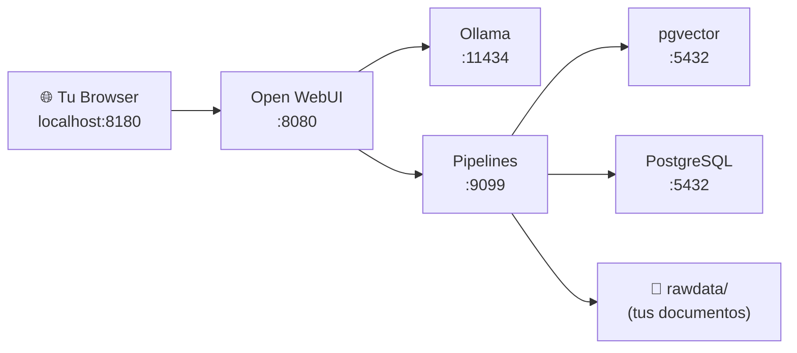

# Explicación completa del proyecto Lifia-Rag

## ¿Qué es este proyecto?

Es un stack de **RAG (Retrieval Augmented Generation)** — un sistema para chatear con modelos de IA locales y darles contexto de tus propios documentos. Todo corre en Docker.

## Estructura de archivos

```
Lifia-Rag/
├── docker-compose.yaml          ← Orquestador: define todos los servicios
├── env/                         ← Variables de entorno por servicio
│   ├── ollama.env               ← Config de Ollama
│   ├── openwebui.env            ← Config de Open WebUI
│   ├── pipelines.env            ← Config de Pipelines
│   ├── db.env                   ← Password de PostgreSQL
│   └── vdb.env                  ← Password de PostgreSQL (vectores)
└── appdata/                     ← Datos persistentes de cada servicio
    ├── ollama/                  ← Modelos descargados (llama3, etc.)
    ├── owui/                    ← DB + archivos de Open WebUI
    ├── pipelines/               ← Código de pipelines RAG
    ├── rawdata/                 ← Documentos fuente para RAG
    ├── postgress/               ← Datos de PostgreSQL
    └── postgress_vector/        ← Datos de pgvector (embeddings)
```

## Los 5 servicios explicados

### 1. `ollama` — El cerebro (LLM engine)
```yaml
image: ollama/ollama
port: 11434
```
- Corre modelos de IA **localmente** (llama3, mistral, etc.)
- Es como tener tu propio ChatGPT sin enviar datos a nadie
- La sección de GPU está comentada (`#deploy...`) porque tu PC no tiene GPU NVIDIA, así que corre en CPU
- `OLLAMA_ORIGINS=*` permite que otros servicios se conecten

### 2. `open-webui` — La interfaz web (el "ChatGPT")
```yaml
image: ghcr.io/open-webui/open-webui:latest
port: 8180 → 8080
```
- Es la interfaz visual donde escribís tus preguntas
- Se accede desde el browser en `http://localhost:8180`
- Adentro tiene un backend Python (FastAPI) y un frontend (SvelteKit)
- Guarda sus datos (usuarios, chats, config) en una DB SQLite dentro de `appdata/owui/webui.db`

### 3. `pipelines` — El motor RAG
```yaml
image: ghcr.io/open-webui/pipelines:main
port: 9099
```
- Procesa documentos, los convierte en embeddings, y los inyecta como contexto en las preguntas al LLM
- Es lo que hace que el IA pueda "leer" tus documentos (los de `rawdata/`)
- Se conecta al host con `host.docker.internal` para comunicarse con otros servicios

### 4. `db` — PostgreSQL general
```yaml
image: postgres:15-alpine
port: 5432
```
- Base de datos relacional, probablemente para que pipelines almacene metadata
- Password: `pass123`

### 5. `vdb` — PostgreSQL + pgvector (vector database)
```yaml
image: ankane/pgvector
port: 5433
```
- PostgreSQL con la extensión **pgvector** para guardar vectores/embeddings
- Es donde se almacenan las representaciones numéricas de tus documentos para búsqueda semántica
- Password: `pass456`

## ¿Cómo se conectan entre sí?



## ¿De dónde vino el problema? ¿Es culpa de tu director?

### Respuesta corta: **No, no es culpa de tu director.**

### Respuesta larga:

El `docker-compose.yaml` que te pasó tu director **está bien configurado**. Lo único que le faltaba era `OLLAMA_BASE_URL` en `openwebui.env` (que agregamos nosotros), pero ese no era el problema real.

El problema fue este:

| Hecho | Explicación |
|---|---|
| El compose usa `image: open-webui:latest` | `:latest` significa "descargame la **última** versión disponible" |
| Cuando hiciste `docker compose up`, Docker descargó la versión más reciente | Esa versión fue publicada el **27 de marzo de 2026** por los desarrolladores de Open WebUI |
| Esa versión tiene un **bug** en sus migraciones de base de datos | El código Python (ORM) espera una columna `scim` en la tabla `user`, pero la migración Alembic que crea la tabla **no incluye esa columna** |
| Al arrancar, cada request a `/api/config` crashea con `sqlite3.OperationalError: no such column: user.scim` | El frontend detecta que el backend no responde y muestra "Open WebUI Backend Required" |

### ¿Qué es "27 de marzo"?

No es algo que hayas hecho vos — es la **fecha en que los desarrolladores de Open WebUI publicaron esa versión de la imagen Docker** en GitHub Container Registry. Vos la descargaste hoy (4 de abril) pero lo que descargaste fue el build del 27 de marzo porque es el `:latest` acá actual.

### En resumen

- ✅ El docker-compose de tu director → **correcto**
- ✅ Tu configuración → **correcta** (después de agregar `OLLAMA_BASE_URL`)
- ❌ La imagen `open-webui:latest` (build 27/mar) → **tiene un bug** en las migraciones de DB
- ✅ El fix → agregar la columna `scim` manualmente (lo que hicimos)

> [!WARNING]
> Si hacés `docker compose pull` en el futuro y se actualiza la imagen, este bug podría reaparecer o resolverse dependiendo de la versión que descargues. Siempre revisá los logs con `docker logs lifia-rag-open-webui-1` antes de entrar en pánico.
